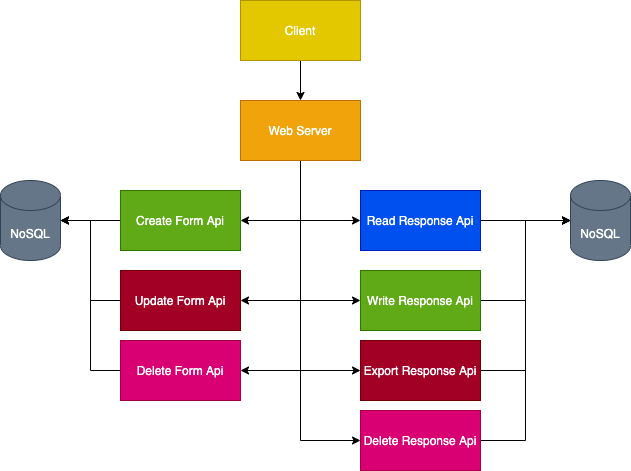
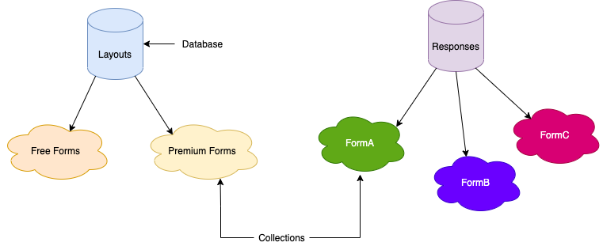

# FlexForms Design

## Requirements

*The application must ..*
-   Allow creators to create forms
-   Allow creators to load forms
-   Allow creators to save forms
-   Allow responders to fill forms
-   Allow creators to view forms responses
-   Maintain a collection of forms

*The application should be ...*
-   Intuitive to use
-   Available 24/7
-   Updatable

## Design Overview


## Data Modelling


Example Temporary ids collection entry
```
{
	"form_id": "kgefijongeornoejfnw3435448trfn90e",
	"form_name": "My Form"
	"form_owner": "John Bailer",
	"owner_email": "jbailey@xyz.com",
	"date_created": "20210101-20:00:00",
	"response_key": KLEUO10,
	"editing_key": KLEU011,
	"view_key": KLEU012,
	"tools": [
		{
			"type": "Number",
			"xPosition": "50%",
			"yPosition": "50%",
			"width": "50%",
			"height": "50%"
		},
		{
			"type": "Panel",
			"xPosition": "50%",
			"yPosition": "50%",
			"width": "50%",
			"height": "50%",
			"color": "blue"
		},
		{
			"type": "Label",
			"xPosition": "50%",
			"yPosition": "50%",
			"width": "50%",
			"height": "50%",
			"text": "Full Name"
		}
	]
}
```
Note: Percentages are used for positions instead of absolute values inorder to ensure responsiveness. 
We will have two functions
- pixelsToPercentage(client, pixels)
- percentageToPixels(client, percentages)

Example FormA collection entries
```
{
	{
		"response_time": "20210101-02:00:00",
		"response_ip": "192.168.1.2",
		"Name": "Paul",
		"Surname": "Ologeh",
		"Date Of Birth": "09-03-1997"
		"Message": "This is a test message"
	},
	{
		"response_time": "20210202-23:00:00",
		"response_ip": "192.168.1.1",
		"Name": "John",
		"Surname": "Smith",
		"Date Of Birth": "09-03-1987"
		"Message": "This is another test message"
	}
}
```
